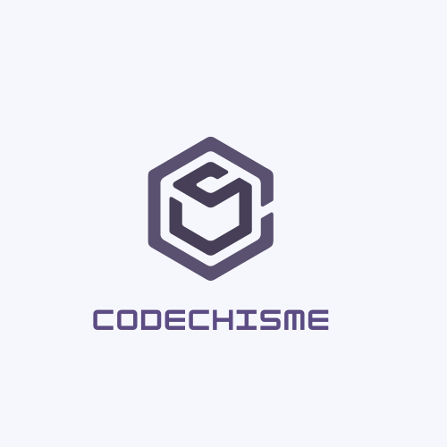

# Code Chisme Backend

A social platform that facilitates communication among developers and the programming community alike.\

The frontend can be found [here](https://github.com/barbarabontempo/CodeChisme-frontend)

### Prerequisites

1. Install [HomeBrew](https://brew.sh/)\
`$ /bin/bash -c "$(curl -fsSL https://raw.githubusercontent.com/Homebrew/install/master/install.sh)"`
2. Install [Ruby](https://www.ruby-lang.org/en/)\
`$ brew install ruby`
3. Install [Rails](https://rubyonrails.org/)\
`$ gem install rails`
4. Install [PostgreSQL](https://www.postgresql.org/)\
`$ brew install postgresql`

## Getting Started
1. Clone this repository and `cd` into the directory
2. Install Dependencies\
`$ bundle install`
3. Initiate the database, migrate provided tables, and seed provided data\
`$ rails db:create db:migrate db:seed`
4. Start the rails server, this will start the Rails Backend API on port 3000
`$ rails s`
### Feature to come
* Video  chat
* Emojis 
* Voice messaging
